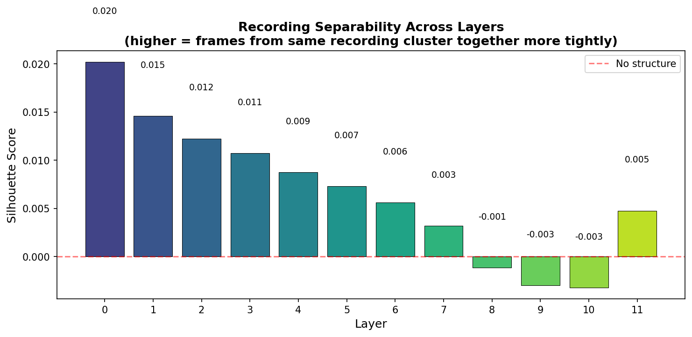
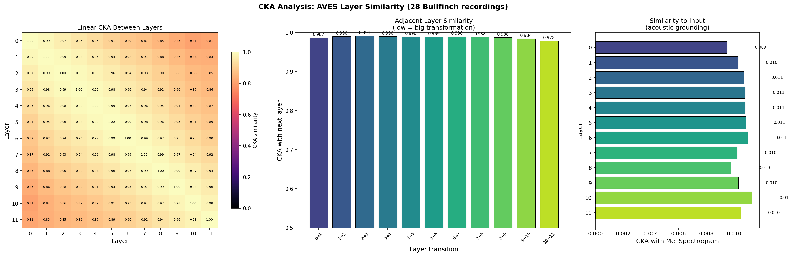
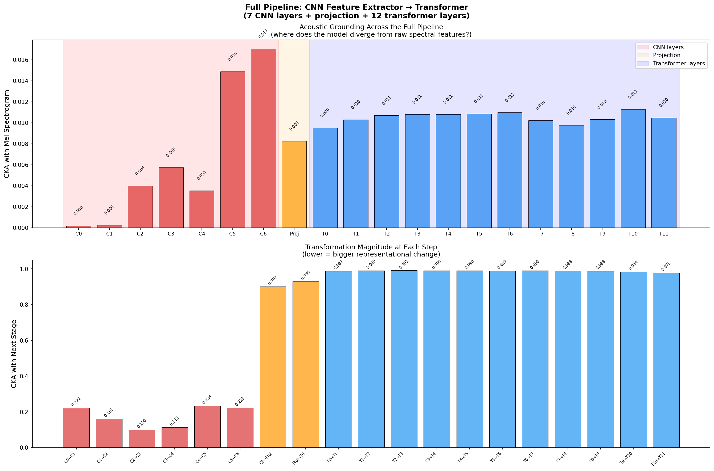
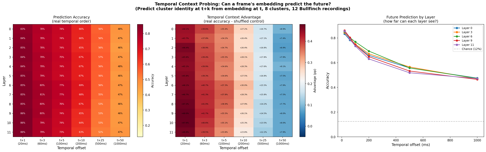
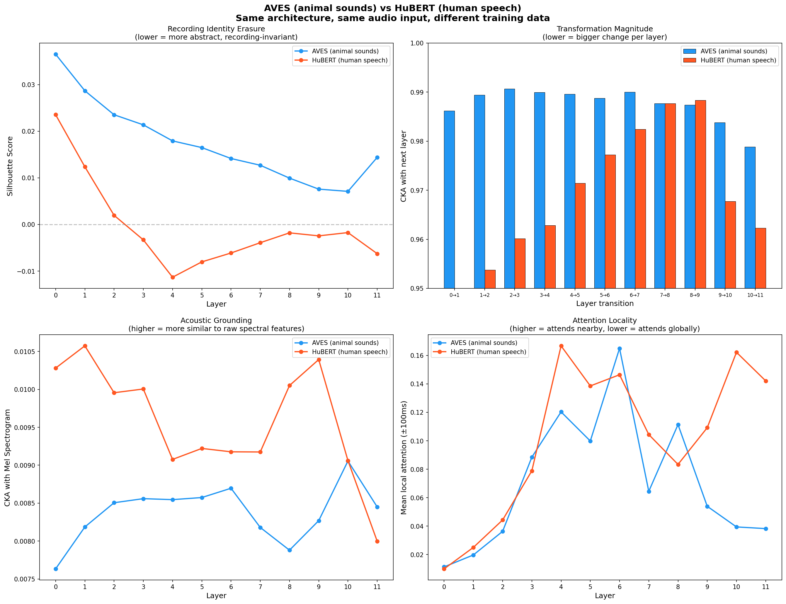

# Sentient Futures — AVES Interpretability

Exploratory interpretability research on [AVES/BirdAVES](https://github.com/earthspecies/aves), a HuBERT-based self-supervised transformer for animal vocalizations (Earth Species Project).

## What we've done so far

### 1. Layer representation analysis (`explore_layers.py`)

Extracted frame-level embeddings from all 12 transformer layers for two species (Helmeted Guineafowl, Eurasian Bullfinch), projected to 2D with PCA.

**Finding:** Early layers encode shared acoustic features (species overlap). By mid-layers, species separate cleanly. Late layers show sub-clusters within each species — likely distinct vocalization/syllable types.


### 2. Attention head analysis (`explore_attention.py`)

Hooked into Q/K projections across all 144 attention heads (12 layers x 12 heads) to extract and visualize attention weight matrices.

**Findings:**
- **Early layers** use local attention (±100ms) — acoustic/spectral processing
- **Late layers** shift to global attention — frames reach across the full sequence
- **Functional specialization** within layers: some heads stay local (pitch/rhythm tracking) while others go global (structural matching), even at the same depth
- **Vertical stripe patterns** in late layers indicate "anchor frames" — acoustically salient moments that all frames attend to


### 3. Cluster analysis (`explore_clusters.py`)

Clustered late-layer (layer 11) frame embeddings with k-means and mapped cluster labels back onto spectrograms. Exported audio clips per cluster for listening.

**Finding:** Clusters align with spectrogram structure — distinct vocalization types, silence, and call sub-phases. Comparing similar clusters (e.g., Guineafowl C1 vs C2, cosine similarity 0.86) revealed the model splits on subtle spectral differences below human perceptual thresholds.

### 4. Species linear probe (`probe_species.py`)

Trained logistic regression probes per layer to classify Bullfinch vs Hawfinch using 9 recordings from [xeno-canto](https://xeno-canto.org). Leave-one-recording-out cross-validation.

**Finding:** Species is linearly separable from layer 0 (90%), peaks at layer 1 (94%), then **dips** in mid-layers (5-6, ~84%) before recovering at layer 11 (91% with lowest variance). The mid-layer dip suggests a representational bottleneck where the model discards raw spectral cues and reorganizes toward abstract features.


### 5. Within-species structure (`explore_individuals.py`)

PCA + silhouette analysis on 28 Bullfinch recordings from xeno-canto across all 12 layers. Tests whether the model preserves or erases recording identity.

**Finding:** The model **progressively erases recording identity** across layers. Silhouette score drops monotonically from 0.020 (layer 0) to negative values (layers 8-10), meaning late-layer representations organize by vocalization type rather than recording source. The model learns what's invariant across recordings (the species' vocal repertoire) rather than what's specific to each (noise, mic, individual).



### 6. CKA layer similarity (`explore_cka.py`)

Computed linear CKA (Centered Kernel Alignment) between all pairs of transformer layers, plus CKA against mel spectrogram input.

**Findings:**
- **Two processing regimes:** Layers 0-6 form one block (high mutual CKA), layers 7-11 form another. Confirms the phase transition seen in all prior analyses.
- **Late layers do the heavy lifting:** Adjacent CKA drops most sharply at layers 9→10→11, meaning the final layers make the largest single-step transformations.
- **All transformer layers have diverged from raw acoustics:** CKA with mel spectrogram is ~0.01 across all layers — the CNN feature extractor (pre-transformer) has already transformed the signal dramatically. The acoustic→abstract transition begins before layer 0.



### 7. Full pipeline: CNN feature extractor (`explore_cnn_layers.py`)

Hooked into all 7 CNN convolutional layers to trace the full pipeline from raw audio through to the transformer.

**Findings:**
- **CNN layers do the heavy lifting:** Adjacent CKA between CNN layers is 0.10-0.23 (massive transformation per step), vs 0.97-0.99 for transformer layers. Each CNN layer transforms the signal more than all 12 transformer layers combined.
- **CNN builds toward spectrogram-like features:** CKA with mel spectrogram peaks at CNN layer 6 (0.017), not layer 0. The CNN is constructing spectral representations, not destroying them.
- **The real processing divide is CNN vs transformer**, not early vs late transformer layers.



### 8. Temporal context probing (`explore_temporal.py`)

Tests whether later layers encode more temporal context (can predict future frames) than early layers. For each layer, trains a linear probe to predict the cluster identity of frame t+k from the embedding at frame t, across offsets of 20ms to 1000ms.

**Finding:** All layers predict the future **equally well** — layer 0 and layer 11 are nearly identical (83% at t+1, ~47% at t+50). The temporal context advantage over shuffled controls is +40pp at short offsets, fading to +8pp at 1 second. This means temporal prediction comes from the **CNN feature extractor's receptive field**, not the transformer. The transformer refines *what kind* of sound it is, not *what comes next*.



### 9. AVES vs HuBERT comparison (`compare_hubert.py`)

Same architecture (HuBERT-base, 12 layers, 768-dim), same Bullfinch audio input, different training data: AVES trained on animal sounds, HuBERT trained on human speech. Tests whether the layer hierarchy is architecture-driven or data-driven.

**Findings:**
- **Recording identity erasure:** Both erase across layers (architecture), but AVES retains more recording-specific info early on — animal sounds have more individual variation that matters.
- **Transformation magnitude:** HuBERT makes bigger jumps at layers 0→1 and 2→3 (CKA drops to 0.955); AVES stays above 0.97 throughout. HuBERT is more aggressive in early transformations.
- **Acoustic grounding:** AVES maintains higher similarity to mel spectrograms in early layers — it preserves spectral detail longer, consistent with the greater spectral diversity of animal vocalizations.
- **Attention locality:** The biggest difference. AVES shows a jagged, oscillating local/global pattern; HuBERT is smoother and more structured. The models have learned **fundamentally different attention strategies** from their training data.

**Conclusion:** The broad processing hierarchy is architecture-driven (shared by both models). But attention strategies, transformation profiles, and acoustic grounding are shaped by training data — AVES has genuinely adapted to animal vocalizations.



## Setup

```bash
python3 -m venv venv
source venv/bin/activate

# CPU-only PyTorch (use the default pip install torch for GPU)
pip install torch torchaudio --index-url https://download.pytorch.org/whl/cpu
pip install esp-aves torchcodec matplotlib scikit-learn

# Clone AVES repo for configs and example audio
git clone https://github.com/earthspecies/aves.git

# Download model checkpoint (360MB)
mkdir -p models
curl -L -o models/aves-base-all.torchaudio.pt \
  https://storage.googleapis.com/esp-public-files/ported_aves/aves-base-all.torchaudio.pt
```

## Usage

```bash
# Basic inference — extract embeddings from example audio
python run_aves.py

# Layer representation exploration (PCA across layers x species)
python explore_layers.py

# Attention head analysis (hooks into Q/K projections)
python explore_attention.py

# Cluster analysis (spectrogram overlay + audio export)
python explore_clusters.py

# Species linear probe (Bullfinch vs Hawfinch, leave-one-recording-out CV)
python probe_species.py

# Within-species structure (28 Bullfinch recordings, PCA + silhouette)
python explore_individuals.py
```

## Model details

- **Model:** AVES-base-all (95M params, 12 layers, 12 heads, 768-dim)
- **Input:** Raw audio at 16kHz mono
- **Output:** Frame-level embeddings at ~50fps (one 768-dim vector per 20ms)
- **Architecture:** HuBERT (7-layer CNN feature extractor → 12-layer transformer encoder)
