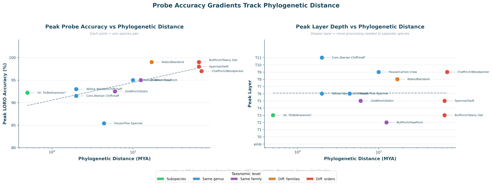
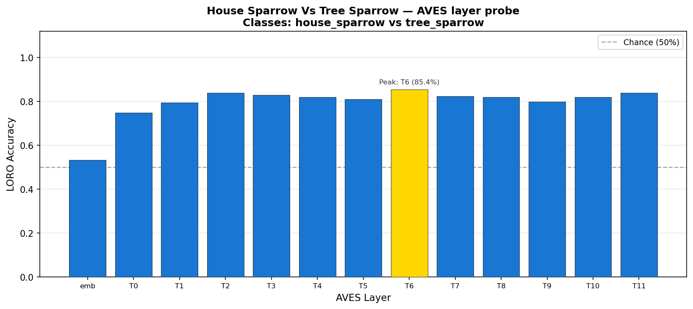
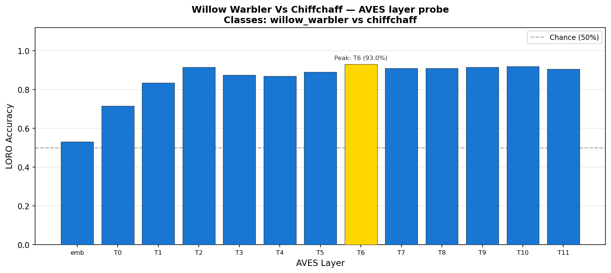
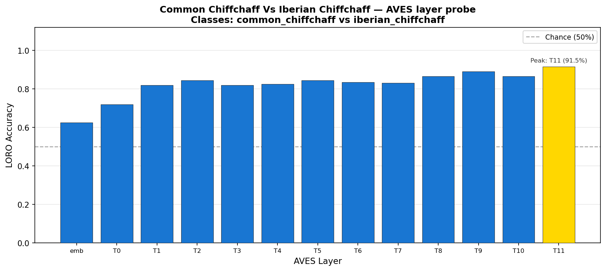
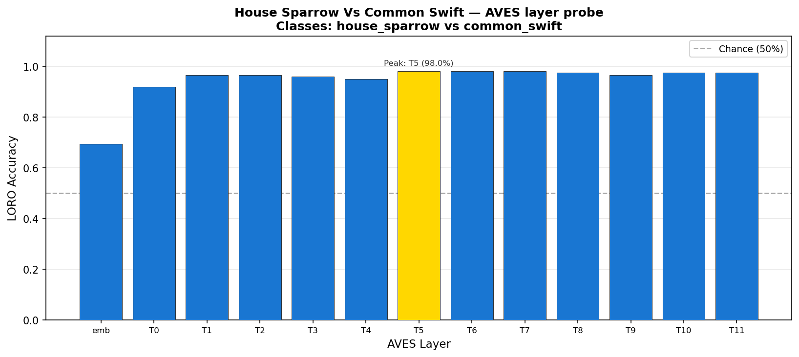
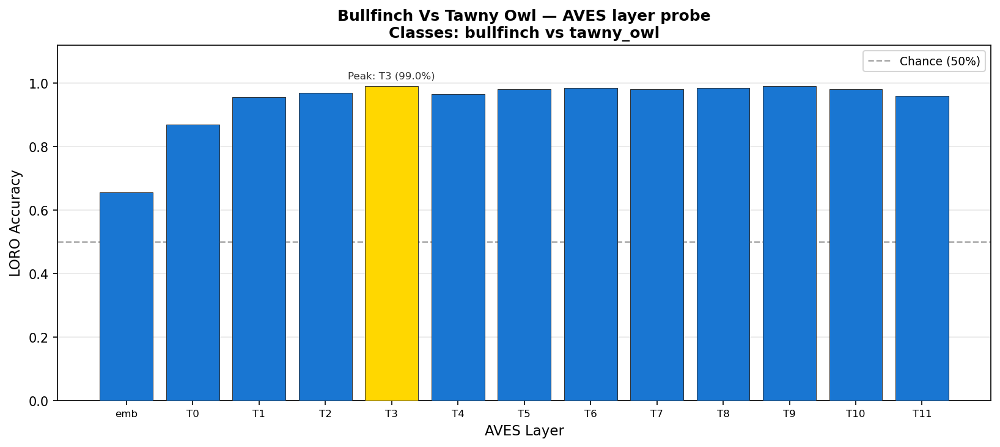
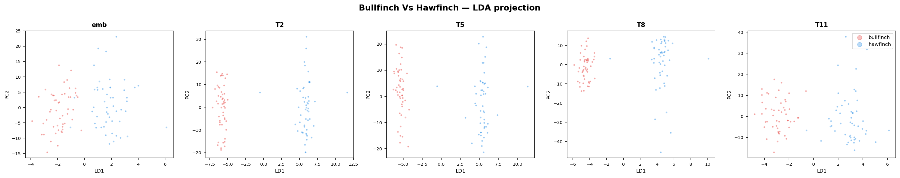
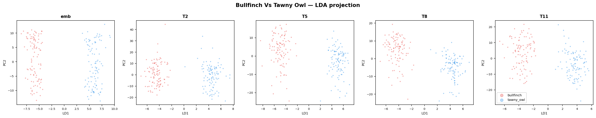
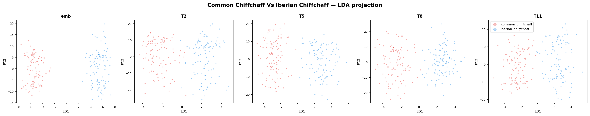

[](LICENSE)
[](https://www.python.org/)

# Mechanistic Interpretability for Interspecies Communication - Towards geometrical analysis of bioacoustic encoder models

Authors: Raphael Sarfati, Siddharth Putta, Evan Harris

What does a classifier model trained on animal vocalizations learn about the animals themselves? We applied mechanistic interpretability techniques to the Earth Species Project's AVEX model family to probe and extract bioacoustic information from the model's activation space. We find that taxonomic structure is distinctly correlated to the model's encoded network depth, where distinctions between taxonomic classes peak at early-mid layers, while species-level separation of the same order and genus requires deeper disentanglement. Phylogenetic distance is found to correlate to probe accuracy and peak layer depth, linear probes show that recent divergence in species pairs requires more layer depth to separate in comparison to pairs of different classes. This gradient reflects consistency with geometric analysis, showing that orthogonal subspaces are developed for class and order information at Layer 12, while fine-grained species classification is de-prioritized. Our results suggest that bio-acoustic classification models implicitly encode evolutionary structure in vocalizations, implicating the use of these models as a venue for research into inter-species linguistic structure. 

---

## Core Finding: Probe Accuracy Scales with Evolutionary Distance

We trained linear probes on activations from 11 species pairs spanning every level of the
avian taxonomic hierarchy.

**Probe accuracy and the depth at which separation
is established both scale positively with phylogenetic distance.**



| Pair | Taxonomy | Peak acc. | Peak layer | Emb. acc. |
|---|---|---|---|---|
| House Sparrow vs Tree Sparrow | Same genus | 85.4% | T6 | 53.3% |
| Willow Warbler vs Chiffchaff | Same genus | 93.0% | T6 | 53.0% |
| Common vs Iberian Chiffchaff | Same genus | 91.5% | T11 | 62.5% |
| House Crow vs Carrion Crow | Same genus | 95.0% | T9 | 72.0% |
| Goldfinch vs Eurasian Siskin | Same family | 92.5% | T5 | 65.5% |
| Bullfinch vs Hawfinch | Same family | 95.0% | T2 | 61.0% |
| European Robin vs Eurasian Blackbird | Diff. families | 99.0% | T8/T11 | 67.0% |
| Chaffinch vs Great Spotted Woodpecker | Diff. orders | 97.0% | T9 | 59.1% |
| House Sparrow vs Common Swift | Diff. orders | 98.0% | T5–T7 | 69.5% |
| Bullfinch vs Tawny Owl | Diff. orders | 99.0% | T3/T9 | 65.5% |

**Same-genus pairs:** embedding layer near chance (~53%); separation builds
progressively through the transformer, peaking at T6–T11.

**Cross-order pairs:** T0 already reaches 87–92%; the encoder establishes
separation within the first one or two transformer blocks and stays near
ceiling throughout.

---

## Probe Results by Pair

### Same genus — separation requires deep layers

House Sparrow vs Tree Sparrow and Willow Warbler vs Chiffchaff are the
clearest cases: the embedding layer is essentially blind (53%), and
separability builds gradually, peaking around T6.

| | |
|---|---|
|  |  |

Common vs Iberian Chiffchaff is the most gradual build of any pair —
accuracy climbs monotonically to T11, consistent with these recently-split
sisters being the acoustically closest species tested.



### Cross-order — separation is immediate

House Sparrow vs Common Swift and Bullfinch vs Tawny Owl both hit ~99% and
are effectively solved by T0–T1. The encoder's early transformer layers
suffice for orders that diverged ~100 Mya.

| | |
|---|---|
|  |  |

### LDA 

- Around 12.5 MYA
- Same genus, and similar birds.
- Separation emerges in mid-to-late layers.


- 65-80 MYA


- 2 MYA
- Separation far more entangled, where the model's resolution breaks down

---

## Geometry Confirms the Probe Signal

Independent geometric analysis of the full NatureLM-audio-training corpus provides an understandable account of why the probing gradient exists.

**`sl_eat_bio_ssl_all` develops a factored hierarchical geometry** — the only
model that simultaneously shows:

1. A learned bio-vs-non-bio directional axis (cosine similarity 0.57 at L9
   vs. random-init baseline 0.91.
2. A Class-level direction at L7 that separates Aves from Mammalia (cos =
   0.38).
3. Orthogonal Class and Order encoding at L12 (cos = 0.074; no other trained
   model below 0.30).
4. Within-Aves species structure at L10 (separability ratio 0.20).

**Training compresses fine species detail to acquire coarser abstractions.**
The random-init baseline has *higher* per-species separability (ratio 0.33)
than any trained model (peak 0.20). Training moves acoustically distinct
same-class species *closer* together as it acquires Class/Order invariances.
This is the geometric mechanism behind the probe plateau for same-genus pairs.

**Architecture sets manifold dimension; training expands the linear
envelope.** Random-init MLE-ID (k=20) = 11–15; trained models = 7–14.
Training does not widen the manifold — it expands the eff_rank / MLE-ID
ratio from ~1 (random) to 17–43 (trained).

---

## Methods

### Probe pipeline

- **Data:** 1000 recordings per species from
  [xeno-canto](https://xeno-canto.org/) via the API.
- **Model:** `sl_eat_bio_ssl_all` (EAT-bio + SSL fine-tune on all audio),
  accessed via [avex](https://github.com/earthspecies/avex).
- **Activations:** 13 layers — CNN projection (`emb`) + transformer blocks
  T0–T11. Mean-pooled over time per recording.
- **Probe:** PCA(50) → LogisticRegression. Leave-one-recording-out (LORO)
  cross-validation; accuracy is mean over folds.

### Geometry pipeline

- **Data:** 600 samples from `EarthSpeciesProject/NatureLM-audio-training`
  (100 × 7 source datasets); fixed manifest, frozen for reproducibility.
- **Models:** All four EAT checkpoints + random-init baseline (seed 42).
- **Activations:** Frame-level, 50 frames per item (seed 42); 30,000 rows per
  (model, layer). TwoNN and MLE-ID subsample to 10,000 rows.
- **Metrics:** Effective rank (`exp(-Σ p_i log p_i)`), participation ratio,
  MLE-ID (k=20), subspace overlap (top-10 PCA bases,
  `scipy.linalg.subspace_angles`). All findings reported with B=50 bootstrap CIs.

---

## Implications
Bioacoustic classification models are trained to distinguish species, but our results suggest they learn something deeper in the process. Probe accuracy scaling with phylogenetic distance, without any evolutionary supervision, indicates that the acoustic signals animals produce carry recoverable information about their evolutionary relationships. The model learned to classify animal vocalizations, yet a phylogenetic tree emerged unsupervised.

The geometric analysis reinforces this: the best-performing checkpoint develops orthogonal subspaces for Class and Order at L12, acquiring coarse taxonomic invariances at the cost of fine-grained species discriminability. A model that had merely memorized acoustic fingerprints would not show this pattern.

The phylogenetic gradient we identify here is a first foothold for interspecies communication research through interpretability on bioacoustic encoder models. In order to define tranferrable linguistics and enact meaningful feature extraction, it can be revealing to understand what structure may be encoded through vocalizations. 

## Future

Several directions follow directly from these findings. The most urgent is statistical hardening: replacing argmax peak-layer with a weighted mean layer metric. Computing bootstrap confidence intervals (B=1000) over LORO folds, and formally testing the phylogenetic gradient with Spearman ρ across pairs would make individual pair estimates stable enough for the correlation to be more statistically meaningful. 

### 1.) Attribution Methods
Linear probes tell us where in the network species become separable. They do not tell us why. We will apply integrated gradients from the probe decision boundary back to the input spectrogram, producing time-frequency heatmaps that show which acoustic features drive classification at each peak layer. For a same-genus pair peaking at T6, this answers whether the model using pitch, temporal envelope, formant structure, or call rhythm? Downstream, sparse autoencoders applied to the 768-dim activations could decompose representations into monosemantic features that fire consistently across species for shared call types. 


### 2.) Unsupervised Structure
The probe asks A vs B. The next question is whether, within a single species, the representation space has internal geometry corresponding to call type, behavioral context, or individual identity. We will apply unsupervised clustering to within-species activations at peak layers and test whether emergent clusters align with available metadata — call type annotations from xeno-canto, geographic origin, or recording context. This requires behaviorally annotated corpora; zebra finch datasets are the most tractable first target.

### 3.) Cross-species generalization
We aim to find whether factored heirarchy in AVEX models is testable. Evaluating our current probe results on tranferred species of same family/order to better understand what taxonomic heirarchy our probes generalize acoustic signatures to. If the model learned general acoustic biology rather than species-specific quirks, a probe trained on one species pair should generalize to a related pair. We will evaluate probe weights trained on one finch pair directly on a held-out finch pair without retraining. Transfer above chance would confirm that the probe captured a family-level acoustic signature — directly testing whether the factored hierarchy Evan identified at L12 is behaviorally operative across the taxonomy

### 4.) Decoding
A long-term vision. We aim to be able to reconstruct sparrow calls from finch calls' representation space through training a decoder on top of a model's representations. Communication requires understanding what a signal means independent of comparison. As a first step toward decoding, we will apply unsupervised call segmentation to continuous recordings, embed each call unit at the peak layer, and test whether clusters from different species with known behavioral context (alarm, contact, song) align in representation space. Cross-species semantic alignment, such as mapping alarms through various species, would be the first evidence of transferable communicative structure.

### 5.) Behavioral grounding
The hardest open problem. We plan to identify existing behaviorally annotated corpora and run the full probe pipeline against behavioral labels rather than species labels. If representation geometry correlates with communicative function across species, that is the result that connects this line of work to genuine interspecies communication in the full sense.

## Setup

```bash
python3 -m venv venv
source venv/bin/activate

# Core dependencies
pip install torch torchaudio transformers huggingface_hub safetensors \
            pyarrow matplotlib scikit-learn scipy timm

# Probe pipeline
pip install avex datasets esp-aves soundfile
```

EAT checkpoint weights pull automatically from `EarthSpeciesProject/esp-aves2-*`
on first use. NatureLM audio shards cache under `~/.cache/huggingface/hub/` (~14 GB).

### Running probes

```bash
# All 10 pairs via NatureLM streaming (GPU recommended for extraction):
python -W ignore scripts/batch_extract_naturelm.py --rows 1000 --device cuda
python -W ignore experiments/naturelm_probe_all_pairs.py

# Single pair from local audio:
python -W ignore experiments/species.py
```

### Running geometry analysis

```bash
# Step 1 — extract activations
python collect_esp_aves2_activations.py \
  --manifest artifacts/manifests/naturelm_by_source_100each_20260418T171459Z.jsonl \
  --models eat_all,eat_bio,sl_eat_all_ssl_all,sl_eat_bio_ssl_all

# Step 2 — geometry scripts (each reads shards, writes to artifacts/comparisons/)
python -W ignore step2_tier1_frame_level.py
python -W ignore step2_random_init_compare.py
```


---

## Repository

| Path | Contents |
|---|---|
| `data/loader.py` | Activation extraction — local files + NatureLM streaming |
| `probes/` | LORO training (`train.py`) and evaluation/plotting (`evaluate.py`) |
| `experiments/` | Runnable probe experiment entry points |
| `scripts/` | Batch extraction, phylogenetic gradient visualization |
| `results/probe-output/` | Accuracy curves and LDA projections per species pair |
| `artifacts/comparisons/` | Geometry CSVs and plots (committed) |
| `RESULTS.md` | Full claim log with retractions |
| `CLAUDE.md` | Developer guide for both pipelines |
