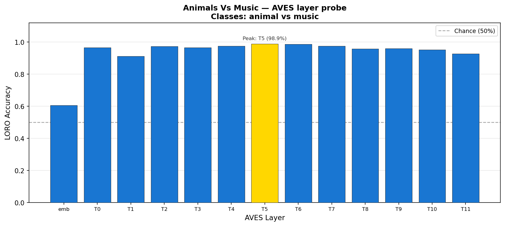

# Phylogenetic Structure in Bioacoustic Audio Encoders

*Preliminary findings — Sentient Futures lab, 2026*

We investigate how a family of self-supervised audio encoders
([ESP-AVES2 EAT](https://huggingface.co/EarthSpeciesProject)) organizes
species identity across its internal layers. Using linear probing and
geometric analysis of residual-stream activations, we find that the encoders
implicitly learn a representation of phylogenetic distance — without any
taxonomic supervision.

---

## Core Finding: Probe Accuracy Scales with Evolutionary Distance

We trained linear probes (LORO cross-validation, PCA(50) → logistic
regression) on activations from 11 species pairs spanning every level of the
avian taxonomic hierarchy. **Probe accuracy and the depth at which separation
is established both scale monotonically with phylogenetic distance.**


| Pair | Taxonomy | Peak acc. | Peak layer | Emb. acc. |
|---|---|---|---|---|
| House Sparrow vs Tree Sparrow | Same genus | 85.4% | T6 | 53.3% |
| Willow Warbler vs Chiffchaff | Same genus | 93.0% | T6 | 53.0% |
| Common vs Iberian Chiffchaff | Same genus | 91.5% | T11 | 62.5% |
| House Crow vs Carrion Crow | Same genus | 95.0% | T9 | 72.0% |
| Goldfinch vs Eurasian Siskin | Same family | 92.5% | T5 | 65.5% |
| Bullfinch vs Hawfinch | Same family | 95.0% | T2 | 61.0% |
| European Robin vs Eurasian Blackbird | Diff. families | 99.0% | T8/T11 | 67.0% |
| Chaffinch vs Great Spotted Woodpecker | Diff. orders | 97.0% | T9 | 59.1% |
| House Sparrow vs Common Swift | Diff. orders | 98.0% | T5–T7 | 69.5% |
| Bullfinch vs Tawny Owl | Diff. orders | 99.0% | T3/T9 | 65.5% |

**Same-genus pairs:** embedding layer near chance (~53%); separation builds
progressively through the transformer, peaking at T6–T11.

**Cross-order pairs:** T0 already reaches 87–92%; the encoder establishes
separation within the first one or two transformer blocks and stays near
ceiling throughout.

---

## Probe Results by Pair

### Same genus — separation requires deep layers

House Sparrow vs Tree Sparrow and Willow Warbler vs Chiffchaff are the
clearest cases: the embedding layer is essentially blind (53%), and
separability builds gradually, peaking around T6.

| | |
|---|---|
|  |  |

Common vs Iberian Chiffchaff is the most gradual build of any pair —
accuracy climbs monotonically to T11, consistent with these recently-split
sisters being the acoustically closest species tested.


### Cross-order — separation is immediate

House Sparrow vs Common Swift and Bullfinch vs Tawny Owl both hit ~99% and
are effectively solved by T0–T1. The encoder's early transformer layers
suffice for orders that diverged ~100 Mya.

| | |
|---|---|
|  |  |

### Animals vs Music — a clean sanity check

Biology vs non-biology separates across all layers with high margin,
confirming that the encoder's feature space is structured around sound
source category before any species-level structure.



---

## Supporting Finding: Geometry Confirms the Probe Signal

Independent geometric analysis of the full NatureLM-audio-training corpus
(600 samples × 4 trained EAT checkpoints + random-init baseline) provides a
mechanistic account of why the probing gradient exists.

**`sl_eat_bio_ssl_all` develops a factored hierarchical geometry** — the only
model that simultaneously shows:

1. A learned bio-vs-non-bio directional axis (cosine similarity 0.57 at L9
   vs. random-init baseline 0.91 — a sharp learned separation).
2. A Class-level direction at L7 that separates Aves from Mammalia (cos =
   0.38), the strongest single learned direction in the model.
3. Orthogonal Class and Order encoding at L12 (cos = 0.074; no other trained
   model below 0.30) — the geometry separates taxonomic levels independently.
4. Within-Aves species structure at L10 (separability ratio 0.20).

**Training compresses fine species detail to acquire coarser abstractions.**
The random-init baseline has *higher* per-species separability (ratio 0.33)
than any trained model (peak 0.20). Training moves acoustically distinct
same-class species *closer* together as it acquires Class/Order invariances.
This is the geometric mechanism behind the probe plateau for same-genus pairs.

**Architecture sets manifold dimension; training expands the linear
envelope.** Random-init MLE-ID (k=20) = 11–15; trained models = 7–14.
Training does not widen the manifold — it expands the eff_rank / MLE-ID
ratio from ~1 (random) to 17–43 (trained).

---

## Methods

### Probe pipeline

- **Data:** 100 recordings per species from
  [xeno-canto](https://xeno-canto.org/) via the API.
- **Model:** `sl_eat_bio_ssl_all` (EAT-bio + SSL fine-tune on all audio),
  accessed via [avex](https://github.com/earthspecies/avex).
- **Activations:** 13 layers — CNN projection (`emb`) + transformer blocks
  T0–T11. Mean-pooled over time per recording.
- **Probe:** PCA(50) → LogisticRegression. Leave-one-recording-out (LORO)
  cross-validation; accuracy is mean over folds.

### Geometry pipeline

- **Data:** 600 samples from `EarthSpeciesProject/NatureLM-audio-training`
  (100 × 7 source datasets); fixed manifest, frozen for reproducibility.
- **Models:** All four EAT checkpoints + random-init baseline (seed 42).
- **Activations:** Frame-level, 50 frames per item (seed 42); 30,000 rows per
  (model, layer). TwoNN and MLE-ID subsample to 10,000 rows.
- **Metrics:** Effective rank (`exp(-Σ p_i log p_i)`), participation ratio,
  MLE-ID (k=20), subspace overlap (top-10 PCA bases,
  `scipy.linalg.subspace_angles`). All findings reported with B=50 bootstrap CIs.

---

## Setup

```bash
python3 -m venv venv
source venv/bin/activate

# Core dependencies
pip install torch torchaudio transformers huggingface_hub safetensors \
            pyarrow matplotlib scikit-learn scipy timm

# Probe pipeline
pip install avex datasets esp-aves soundfile
```

EAT checkpoint weights pull automatically from `EarthSpeciesProject/esp-aves2-*`
on first use. NatureLM audio shards cache under `~/.cache/huggingface/hub/` (~14 GB).

### Running probes

```bash
# All 10 pairs via NatureLM streaming (GPU recommended for extraction):
python -W ignore scripts/batch_extract_naturelm.py --rows 1000 --device cuda
python -W ignore experiments/naturelm_probe_all_pairs.py

# Single pair from local audio:
python -W ignore experiments/species.py
```

### Running geometry analysis

```bash
# Step 1 — extract activations
python collect_esp_aves2_activations.py \
  --manifest artifacts/manifests/naturelm_by_source_100each_20260418T171459Z.jsonl \
  --models eat_all,eat_bio,sl_eat_all_ssl_all,sl_eat_bio_ssl_all

# Step 2 — geometry scripts (each reads shards, writes to artifacts/comparisons/)
python -W ignore step2_tier1_frame_level.py
python -W ignore step2_random_init_compare.py
```

See [`CLAUDE.md`](CLAUDE.md) for the full script reference.

---

## Repository

| Path | Contents |
|---|---|
| `data/loader.py` | Activation extraction — local files + NatureLM streaming |
| `probes/` | LORO training (`train.py`) and evaluation/plotting (`evaluate.py`) |
| `experiments/` | Runnable probe experiment entry points |
| `scripts/` | Batch extraction, phylogenetic gradient visualization |
| `results/probe-output/` | Accuracy curves and LDA projections per species pair |
| `artifacts/comparisons/` | Geometry CSVs and plots (committed) |
| `RESULTS.md` | Full claim log with retractions |
| `CLAUDE.md` | Developer guide for both pipelines |
