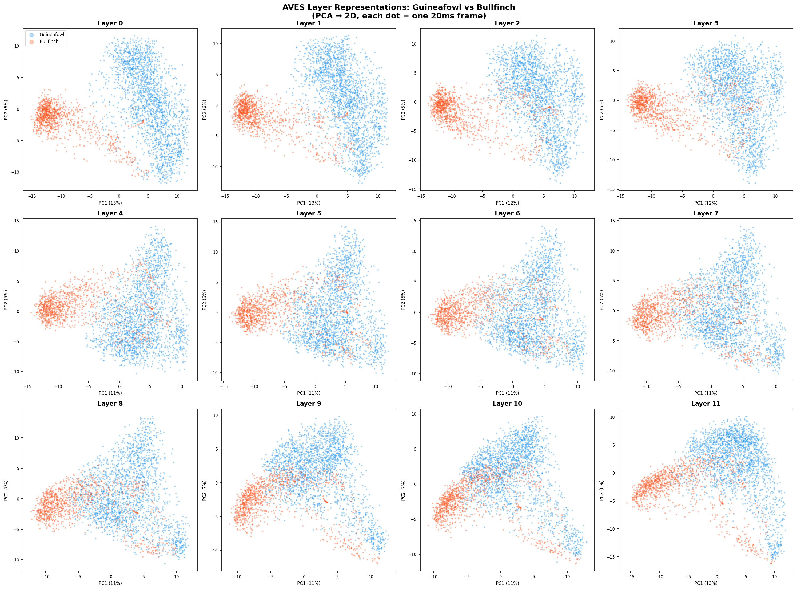
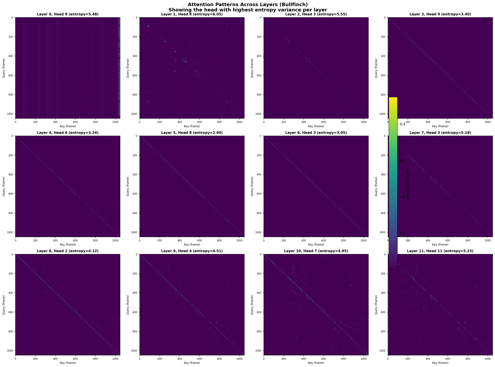
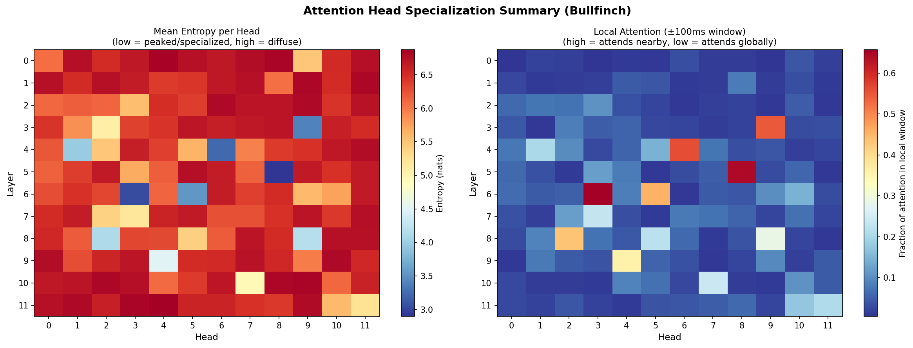
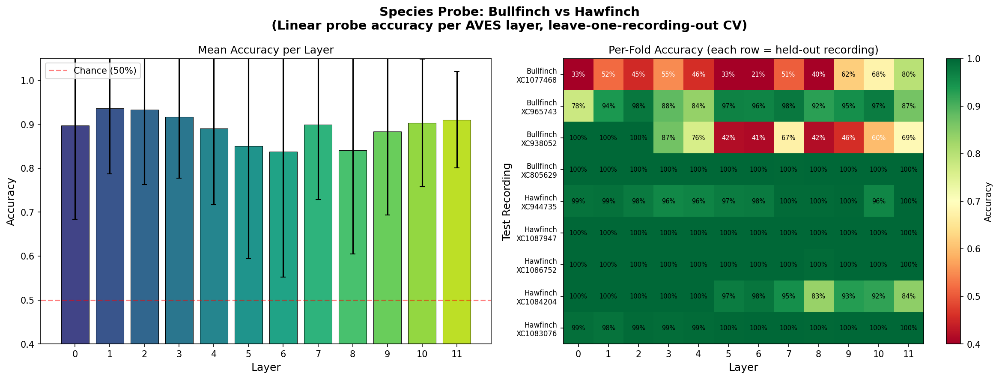

# Sentient Futures — AVES Interpretability

Exploratory interpretability research on [AVES/BirdAVES](https://github.com/earthspecies/aves), a HuBERT-based self-supervised transformer for animal vocalizations (Earth Species Project).

## What we've done so far

### 1. Layer representation analysis (`explore_layers.py`)

Extracted frame-level embeddings from all 12 transformer layers for two species (Helmeted Guineafowl, Eurasian Bullfinch), projected to 2D with PCA.

**Finding:** Early layers encode shared acoustic features (species overlap). By mid-layers, species separate cleanly. Late layers show sub-clusters within each species — likely distinct vocalization/syllable types.



### 2. Attention head analysis (`explore_attention.py`)

Hooked into Q/K projections across all 144 attention heads (12 layers x 12 heads) to extract and visualize attention weight matrices.

**Findings:**
- **Early layers** use local attention (±100ms) — acoustic/spectral processing
- **Late layers** shift to global attention — frames reach across the full sequence
- **Functional specialization** within layers: some heads stay local (pitch/rhythm tracking) while others go global (structural matching), even at the same depth
- **Vertical stripe patterns** in late layers indicate "anchor frames" — acoustically salient moments that all frames attend to




### 3. Cluster analysis (`explore_clusters.py`)

Clustered late-layer (layer 11) frame embeddings with k-means and mapped cluster labels back onto spectrograms. Exported audio clips per cluster for listening.

**Finding:** Clusters align with spectrogram structure — distinct vocalization types, silence, and call sub-phases. Comparing similar clusters (e.g., Guineafowl C1 vs C2, cosine similarity 0.86) revealed the model splits on subtle spectral differences below human perceptual thresholds.

### 4. Species linear probe (`probe_species.py`)

Trained logistic regression probes per layer to classify Bullfinch vs Hawfinch using 9 recordings from [xeno-canto](https://xeno-canto.org). Leave-one-recording-out cross-validation.

**Finding:** Species is linearly separable from layer 0 (90%), peaks at layer 1 (94%), then **dips** in mid-layers (5-6, ~84%) before recovering at layer 11 (91% with lowest variance). The mid-layer dip suggests a representational bottleneck where the model discards raw spectral cues and reorganizes toward abstract features.



## Setup

```bash
python3 -m venv venv
source venv/bin/activate

# CPU-only PyTorch (use the default pip install torch for GPU)
pip install torch torchaudio --index-url https://download.pytorch.org/whl/cpu
pip install esp-aves torchcodec matplotlib scikit-learn

# Clone AVES repo for configs and example audio
git clone https://github.com/earthspecies/aves.git

# Download model checkpoint (360MB)
mkdir -p models
curl -L -o models/aves-base-all.torchaudio.pt \
  https://storage.googleapis.com/esp-public-files/ported_aves/aves-base-all.torchaudio.pt
```

## Usage

```bash
# Basic inference — extract embeddings from example audio
python run_aves.py

# Layer representation exploration (PCA across layers x species)
python explore_layers.py

# Attention head analysis (hooks into Q/K projections)
python explore_attention.py

# Cluster analysis (spectrogram overlay + audio export)
python explore_clusters.py

# Species linear probe (Bullfinch vs Hawfinch, leave-one-recording-out CV)
python probe_species.py
```

## Model details

- **Model:** AVES-base-all (95M params, 12 layers, 12 heads, 768-dim)
- **Input:** Raw audio at 16kHz mono
- **Output:** Frame-level embeddings at ~50fps (one 768-dim vector per 20ms)
- **Architecture:** HuBERT (7-layer CNN feature extractor → 12-layer transformer encoder)
