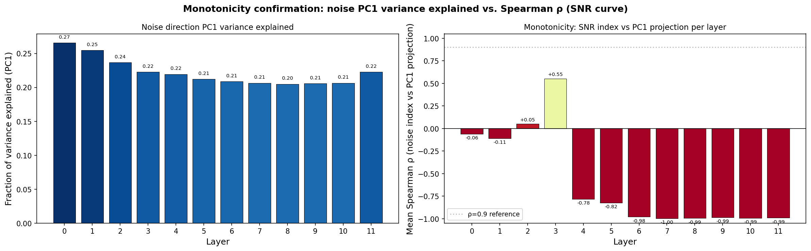
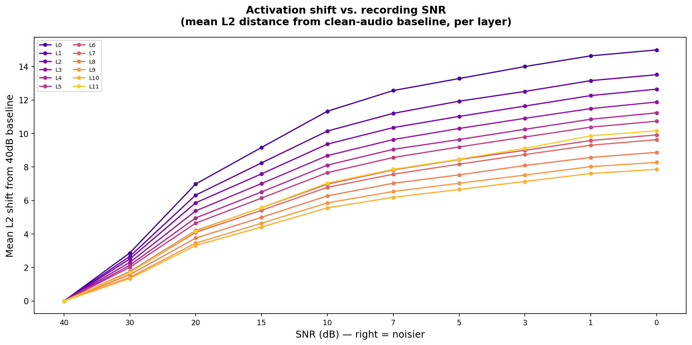
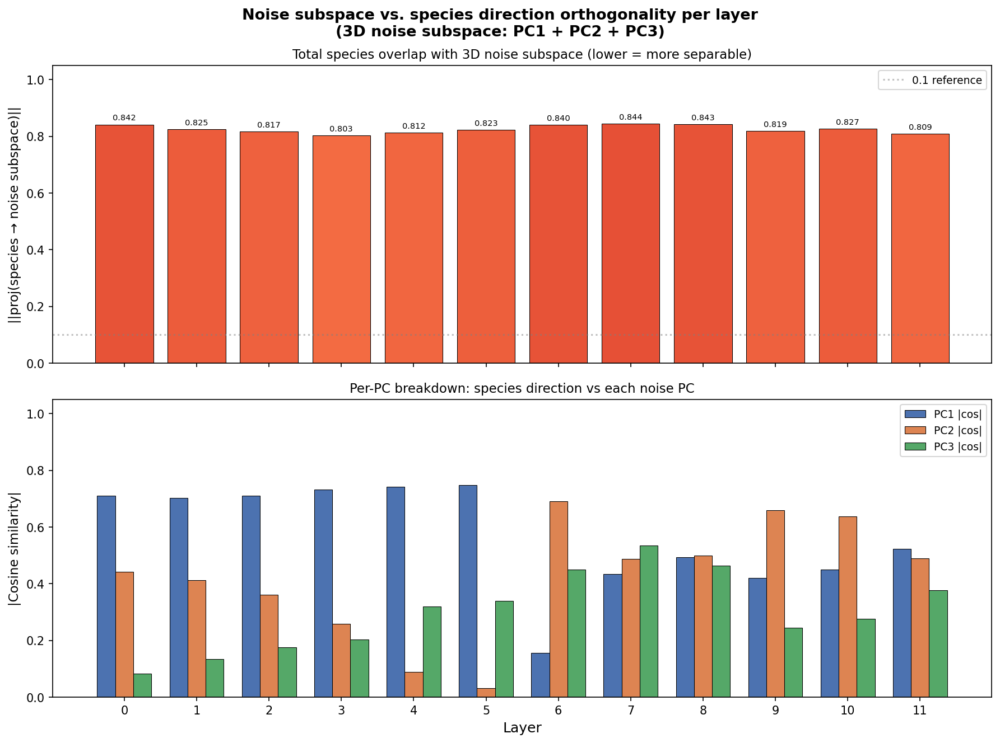

# Isolating Animal Vocalization directions in AVES via White noise 

This experiment takes a single clean guineafowl recording and generates versions of it with increasing levels of white noise added to the raw audio, spanning from near-clean to heavily degraded across 10 levels. Each version is passed through AVES and frame-level activations are extracted at each transformer layer. By fitting a linear direction across the noise-indexed activation vectors, we identify where in the model's representational geometry recording noise lives and whether that direction is orthogonal to the species. A noise direction that is orthogonal to meaningful semantic directions can be subtracted out of downstream representations, leaving a cleaner signal for SAE feature analysis and behavioral grounding work.

## Experimental setup
The experiment starts with inputting a single clean guineafowl reference recording. This recording will be at a noise level of 1, and will be human-annotated to choose a xeno-canto recording with audibly clear bird calls, in combination with matching sonogram features. 

Recording 1 sonogram: 

Recording 2 Sonogram:

Recording 3 Sonogram: 

### AVES / BirdAVES (Earth Species Project) 
***Paper***: Hagiwara (2023), ICASSP. BirdAVES update: ESP blog post, 2024.
***What it is***: Self-supervised transformer encoder for animal vocalisations (“BERT for animals”). Based on HuBERT. Pretrained on large unannotated audio datasets including animal sounds. BirdAVES adds Xeno-canto/iNaturalist bird data and scales to larger models.

This experiment will test if AVES is able to encode noise as a separate construct through investigating consistency in activation space. Essentially, it will work as a cleaning tool for future downstream experiments. Model representations are only as clean as the data going in. We can essentially project this direction in the activation space out of every activation vector in the dataset, thus representing animal signals clearer. 

### Noise Augmentation
The first layer of this experiment aims to find out whether AVEs systematically separates recording quality from linear animal communication. The foundation for this involves checking consistency in the “noise effect”, or checking for monotonicity. In order to do so, we augment each recording with 10 different variants where the only thing changing is noise. 

### Noise_direction1.py
Noise_direction1.py takes each recording in RECORDINGS, generating 10 versions of it. Each of these versions will have added calibrated white gaussian noise at decreasing SNR levels. Levels decrease from 40dB to 0dB. The script calculates required noise power, generates a waveform at that power, adds it to the raw audio waveform, then passes it into the model. Noise_direction1.py then works to extract activation embeddings at all 12 layers per noise version. We then fit a PCA across noise-indexed mean activations in order to find the noise axis. 

## Monotonicity check results

(Figure 1 - noise_direction_variance.png - variance explained between activation vector movement across 10 noise levels)

Our monotonicity check results for variance show a consistent, linear direction at every layer. This means that we are able to extract and subtract this noise direction at every layer. However,this model shows that noise is not perfectly linear, at least at PC1. While subtraction is possible, this suggests that testing PC2, PC3, and possibly other directions may be necessary for clean representation. 

(Figure 2 - Noise activation shift vs recording SNR)
<<<<<<< Updated upstream
=======

>>>>>>> Stashed changes

The x axis for this plot depicts noise SNR level going from clean(40dB) to degraded(0dB). The y axis, meanwhile, is the L2 shift, or how far the mean activation vector at each layer has moved from the baseline per sound increase. A general, visual analysis can depict that the L2 shift is prominent during the early sound additions. Later on, the shift still occurs for each layer, but each layer has a smaller and smaller difference between the clean and augmented activation vector. As their curves are generally consistent, layers 1-10 can be interpreted somewhat equally. The SNR curve graph shows that the AVES model initially reacts sensitively to the first introduction of augmented white noise, then progressively gets less sensitive to later added noise. This means that the model does not treat noise linearly, with each addition of noise producing diminishing returns in L2 shift. Practically, this implies that the model is more sensitive to the differences between high quality and medium quality datasets rather than poor quality and medium quality datasets. Furthermore, this also shows that noise direction is most meaningful at the clean and moderate levels. Going forward, this suggests discarding degraded data through human annotation. 

## Monotonicity check continued 
Our monotonicity check continued with a calculation of the PC elbow. A PC is essentially an explanation of the way noise changes activations. A PC captures the main path of activation movement, not all of it. The PC elbow, meanwhile, signifies when we have found the maximum amount of ways that noise changes activations, all of them being independant of each other. The updated PC elbow calculation in noise_direction1.py shows that there are 3 PCs to explain 80% of the variance at each layer. This means that noise is not a single direction in AVES' activation space, it occupies a 3-dimensional subspace(a plane with 3 axises). Practically, this means that further SAE training experiments will need to project out a 3d subsace rather than one single direction during the cleaning substep. 

## Orthogonality check + Final Results

After finding adequate results on the monotonicity check, we moved to conducting an orthogonality experiment. This experiment, which also lives in noise_direction1.py and takes in bullfinch and hawfinch recordings, is aimed at defining whether recording noise interferes with species classifications. The X-axis follows AVES as it records noise recordings at different layers. The Y-axis is |cos theta| between the noise PC1 and species direction, meaning it measures the angle between two lines in a 768-dimensional space. The closer these lines get to perpendicularity, the less linear overlap that noise has with species identity. The closer these lines get to parallelism, the more confounding this noise gets. The output graph gives us a general takeaway, that the AVES model never fully conflated noise and species identity. Across all layers, noise and species identity never share more than 40% angular proximity. Furthermore, the curve of cosine similarity differences proves an even more interesting insight. The angular proximity in the first 5 layers stays close to 0.4, while it starts to decrease, shifting inconsistently from layer 6 onwards. 